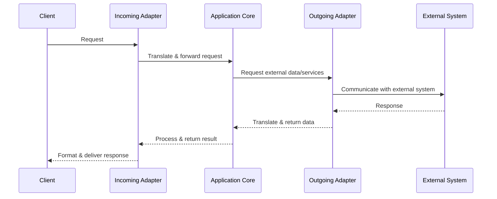

Architecture & Technologies
===
[](https://github.com/asubaruwrxsti/flask_rework)
[](https://github.com/asubaruwrxsti/flask_rework/actions/workflows/main.yaml)
[](https://github.com/asubaruwrxsti/flask_rework/commits/main)

## Table of Contents

[TOC]

## [Hexagonal Architecture](https://www.geeksforgeeks.org/hexagonal-architecture-system-design/)

Hexagonal Architecture (also known as Ports and Adapters) for your microservices. It's particularly well-suited for microservices because it:

Clearly separates your business logic from external concerns
Makes your services more testable and maintainable
Allows you to change external dependencies without affecting core functionality

Here's how you could structure each microservice:
```gherkin=!
Feature: Service Architecture Structure

  Background:
    Given a service named "service_name"

  Scenario: Core domain organization
    When I navigate to the "/core" directory
    Then I should find the following subdirectories:
      | domain    | For business entities and value objects       |
      | use_cases | For application logic and business rules      |
      | ports     | For interfaces defining core interactions     |

  Scenario: Ports organization
    When I navigate to the "/core/ports" directory
    Then I should find the following subdirectories:
      | incoming | For API contracts                             |
      | outgoing | For repository and external service interfaces |

  Scenario: Adapters organization
    When I navigate to the "/adapters" directory
    Then I should find the following subdirectories:
      | incoming | For HTTP controllers and message consumers    |
      | outgoing | For DB repositories and external API clients  |

  Scenario: Configuration and entry points
    Then I should find the following at the root level:
      | config     | For configuration                            |
      | main.py    | Application entry point                      |
      | Dockerfile | Container definition                         |
```

### Hexagonal Architecture Sequence Flow



This architecture forces you to think about your domain model first and keeps your business logic completely isolated from HTTP, database, or other infrastructure concerns.
The key benefit is that your business logic doesn't depend on Flask, databases, or other external systems - they become replaceable "adapters" around your core domain. This makes your services more resilient to change and easier to test.
It has a steeper learning curve but provides more long-term benefits for complex applications, especially in a microservices context.

### Current Implementation

Core Components
Core Domain (src/core/domain/)

Contains business entities and logic
Independent of external concerns
Pure business rules and domain models
Use Cases (src/core/use_cases/)

Application-specific business rules
Orchestrates the flow of data
Implements business operations
Ports (src/core/ports/)

Defines interfaces for:
Incoming (API contracts)
Outgoing (repository/external service interfaces)
Adapters (src/adapters/)

Incoming: HTTP controllers, API endpoints
Outgoing: Database repositories, external API clients
Flow of Control
The key benefit is that the business logic in the core domain remains isolated from external dependencies like FastAPI, databases, or other systems. 

Tests can be found in tests and the application entry point is main.py.

# Technology Stack


## Frontend
- **Framework**: React, NextJS, Htmx
- **Templating**:  handlebars.js
- **State Management**: recoil
- **Styling**: Tailwind
- **API Communication**: Axios/Fetch API
- **Testing**: Jest/React Testing Library/Cypress
- **Code Guide**: airbnb / javascript

## Backend
- **Language**: Python/Node.js/Go
- **Framework**: FastAPI/Express/Gin
- **Authentication**: JWT/OAuth2/Keycloak, authentik
- **Validation**: Pydantic/Joi/Go validator
- **Search Engine**: quickwit

## Persistence
- **Database**: MongoDB
- **ORM/ODM**: SQLAlchemy/Mongoose/GORM
- **Migrations**: Alembic/Liquibase/Flyway
- **Caching**: Redis/Memcached
- **Data Pipelines**: airbyte

## Infrastructure
- **Containerization**: Docker
- **Orchestration**: Kubernetes/Docker Compose
- **CI/CD**: GitHub Actions/Jenkins/CircleCI
- **Cloud Provider**: AWS/GCP/Azure
- **Application Proxy**: traefik, frp
- **Scheduling**: dolphinscheduler
- **Download Manager**: gopeed

## Monitoring & Observability
- **Logging**: ELK Stack/Fluentd
- **Metrics**: Prometheus/Grafana
- **Tracing**: Jaeger/Zipkin
- **Hardware Monitoring**: Checkmate
- **Alerting**: PagerDuty/Opsgenie

## Development Tools
- **Version Control**: Git/GitHub
- **Documentation**: Swagger/OpenAPI/Postman
- **Code Quality**: ESLint/Sentry
- **Package Management**: npm/pip/Go modules

## Communication
- **Synchronous**: REST, GraphQL, gRPC, tonic
- **Asynchronous**: RabbitMQ/Kafka/NATS
- **Notification System**: novu

## Other Links

- [Developer Roadmap](https://github.com/kamranahmedse/developer-roadmap) - A set of charts illustrating the paths to follow and technologies to learn to become a developer
- [Awesome Software Architecture](https://github.com/mehdihadeli/awesome-software-architecture) - A curated list of resources on software architecture, patterns, and principles
- [Java Design Patterns](https://github.com/iluwatar/java-design-patterns) - Implementation of various design patterns in Java with explanations
- [Awesome System Design Resources](https://github.com/ashishps1/awesome-system-design-resources) - A collection of resources for learning system design
- [Awesome Cheatsheets](https://github.com/LeCoupa/awesome-cheatsheets) - Cheatsheets for various programming languages, frameworks, and development tools

###### tags: `Architecture & Technologies` `Documentation`
